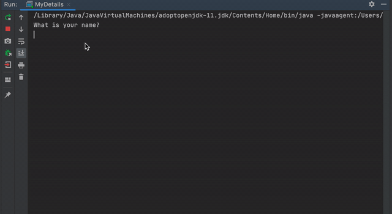
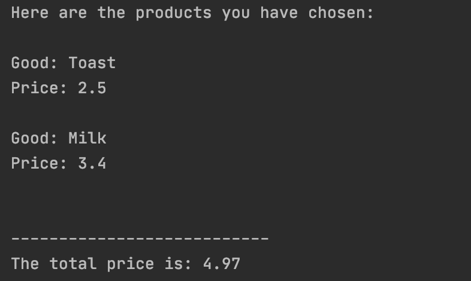

# 1. Java Banking System
This project is in package BankingSYstem.
There are 5 user cases in this project.
1. User can check balance.
2. User can deposit money.
3. user can withdraw money.
4. User can check latest transaction.
5. User can exit this project.

Here is a short demo:

# 2. My Details Score System
This project is in package MyDetails.
User can enter name, hobby, born year and score of 3 courses.
System will calculate your age and your average score.
Here is a short demo:

# 3. Grocery 
### Implementation
This project is in package POSclass.
We write a parent class Food. Fruit, Meat and Vegetable
are extended from this Food class. We only override the toString function
for each child class.
The main function is weitten in Grocery.

### User Case
There are several ways to handle exception.
1. User type in wrong format of input Strings.
2. User select food which is not in the menu.

# 4. Supermarket
### Implementation
This project is in package Supermarket. DairyProduct and BeverageProduct
are inherited from GroceryProduct. Fat and Sugarlevel are 2 enums.
The main function is in GroceryProduct.
Here is a demo:

# 5. Threads
### intro
We use threads in 3 cases:
- Blocking I/O
- GUI applications
- Independent tasks